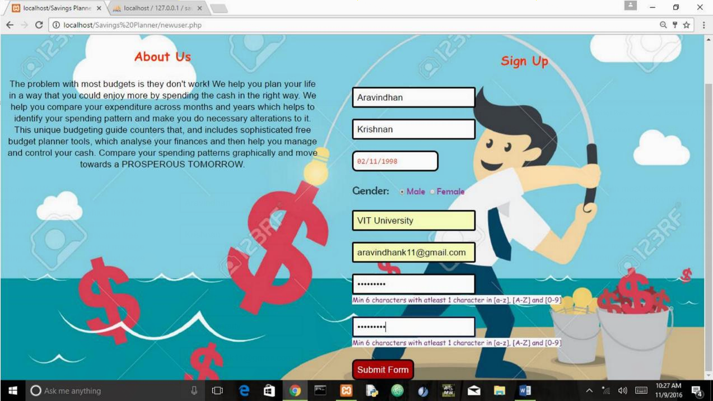
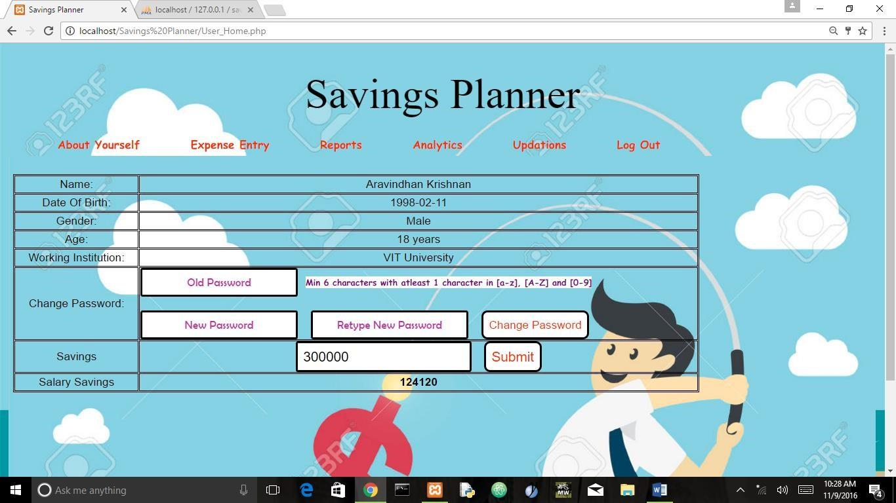
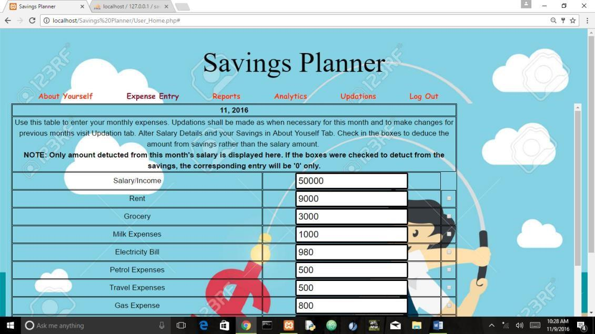
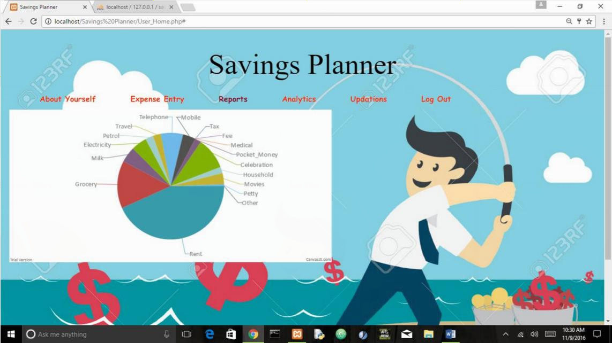
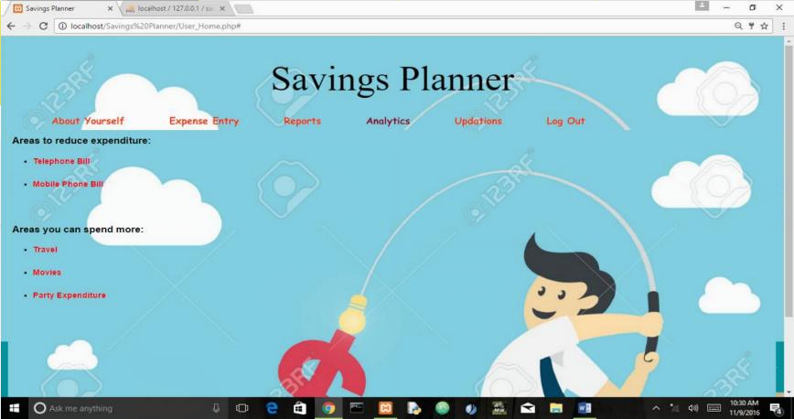

# Savings-Planner
An online web application tool to make reports, charts and basic analysis of the income and expenditures of day-to-day  happenings.

## Motivation
Nowadays people spend a lot of money which leads to a stressed life due to lack of proper financial management. We hope to rectify that with our savings planner. Proper financial management is essential to have a better tomorrow. Therein lies
the scope of our project. The project is designed is such a way that it not only stores the data of all of one’s expenditure but also returns an analysis. There are inputs for various everyday expenditures but we have also included an option for miscellaneous expenses. No expense can therefore go unaccounted. The decision to include the analysis feature was based on the fact that people do not keep track of their expenses diligently. The analysis feature provides feedback and suggestions in areas where you should cut down on your spending and suggests leisure activities based on the amount you have saved. Report generation is both verbal and visual. Expenditure is pictorially represented as a pie chart

## Tools and Languages Used
1. XAMPP
2. PHP
3. HTML5 and CSS
4. MySQL
5. Javascript

## Modules and Functionality:
1. **Sign-Up Login and Log Out**
  Users are asked to enter details like name, date of birth, password and working institution for signing up and their validity is checked. If all the details are proper a new entry is made to ‘userdetails’ table. Every time the user logs in the
validity of the user Is checked in the ‘userdetails’ table and if correct the user is enabled to log in. Log out terminates the session and does not allow to go back to the page until and otherwise proper log in details are again given.
  

2. **About Yourself**
  The module holds all the details of the user and allows user to change passwords and initial savings. The password entered are verified for the validity and then updated into the ‘userdetails’ table of the database. The users are also enabled to enter the initial savings that are entered into the table and also displays the salary savings of the users.
  
  
3. **Expense Entry**
  This module holds the major Database entry part where in users are asked to enter their salary and expenses details as which are updated in the ‘expenses’ table of the database. For repeated entry and a new row is inserted for every month of the year for every user. The module also empowers the user to decide whether to detect the expenses from the salary savings or main balance savings .
  
  
4. **Monthly Report**
  The module provides the visual analytics view of the expenditure where the user can visually view the way in which they spend their salary. The graph on hover gives details about the percentage of the total expenses in the particular
expenditure and also the amount spend on the specific expenditure.
  
  
5. **Analytics**
  The module intuitively suggests the user on how to and how not to spend their expenses. It lists the user where to spend more and where to spend less based on the specific slabs fixed for each and every expense.
  
  
## Future Work
1. The Analytics used in the project is naive, and can be further improved by applying Machine Learning Algorithm
2. Every entry in the database must be stored after encrypting with Eliptical Cryptographic Algorithm in order to assure the users with utmost reliability and security that the data will never be shared
3. Proper integration with other applications of Amazon, Walmart can even make the product more user firendly.
